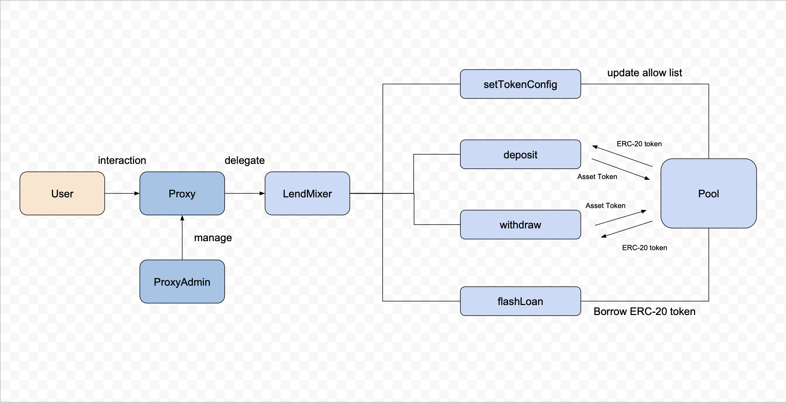

# LendMixer

A minimalist flash loan service that supports all tokens compatible with the ERC-20 token standard.


## Introduction

LendMixer is a lightweight flash loan service offering the following features:

1. Users enjoy the flexibility to customize token settings, allowing the service to seamlessly support a diverse range of tokens.
2. By depositing ERC-20 tokens in the allow list, users can earn revenue when withdrawing.
3. Initiating a flash loan incurs a minimal fee of only 0.3%.

In addition to ERC-20 tokens, our service also supports the native Ether token, and the `WETH` (Wrapped Ether) is provided for seamless integration.

1. WETH supports a flash Mint mechanism, enabling users to acquire a substantial amount of wrapped tokens seamlessly.
2. For enhanced flexibility, we provide support for ERC-20 extensions such as ERC-677 and ERC-3156.
3. Best of all, `WETH` does not incur any fees

## Usage

The service is currently under testing and will be available on the mainnet soon.

The complete guide for the services please refers to the [wiki](https://github.com/LouisTsai-Csie/LendMixer/wiki)

## Layout

The project consists of the following part, the core logic of lending located in `lending` folder.

```text
src
├── interface
│   ├── IERC3156FlashBorrower.sol
│   ├── ILendMixer.sol
│   └── IProxy.sol
├── lending
│   ├── asset.sol
│   ├── lendMixer.sol
│   └── weth.sol
├── library
│   └── slot.sol
└── proxy
    ├── proxy.sol
    ├── proxyAdmin.sol
    └── storage.sol
```


## Installation

### Foundry

Downloan `foundry` if first time

```
curl -L https://foundry.paradigm.xyz | bash
```

Check `forge` version and the response should be like `forge 0.2.0 (c312c0d 2023-12-22T00:20:29.297186000Z)`
```
forge --version
```

### Repo

1. Clone the repository with the following command: git clone git@github.com:LouisTsai-Csie/LendMixer.git
Navigate to the project directory: cd lendmixer
To view the testing layout, run the command: forge test -vvv. The expected result will resemble the following message.

`Ran 4 test suites: 32 tests passed, 0 failed, 0 skipped (32 total tests)`


Testing layout for the project:

```text
test
├── lending
│   ├── asset.t.sol
│   ├── lendMixer.t.sol
│   └── weth.t.sol
├── library
│   └── slot.t.sol
└── proxy
    └── proxyAdmin.t.sol
```


## Structure

**LendMixer**

